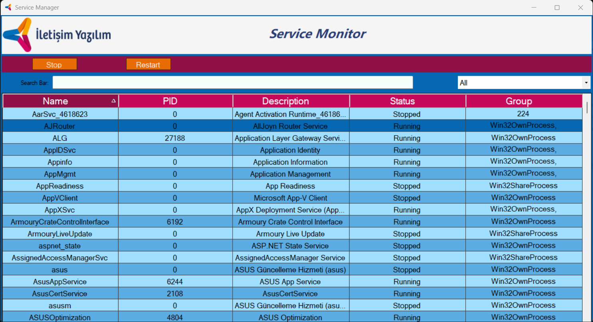

# Windows Service Manager

- Developed for [İletişim Yazılım](https://www.iletisimyazilim.com/)
- Inspired from the Windows Services Menu and it Attend to Next Level
  - All TaskBar Service feature
 
  - "Kill" feature can be used for services
 
  - Desired service can be pinned (This Feature have special table )

  - Could add Non-Stop Services (This Feature have special table )
   
  - You can Schedule for "Time Worker", stop or start services after the desired Interval Period.
    - This time worker continues to work unless cancelled.
      
- View of the Application:
  
